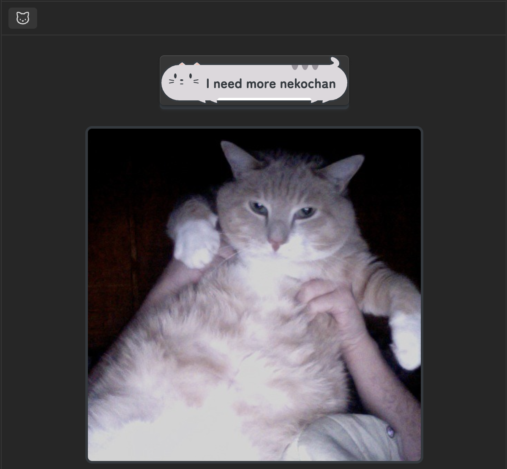

# Obsidian Plugin: Nekochan

## 📝 Overview
**Nekochan** is an Obsidian plugin that displays a random cat image in the sidebar.  

This plugin was created as a learning project based on the tutorial from [TypeScript Book](https://typescriptbook.jp/tutorials/nextjs), which helped to understand TypeScript and React fundamentals.

